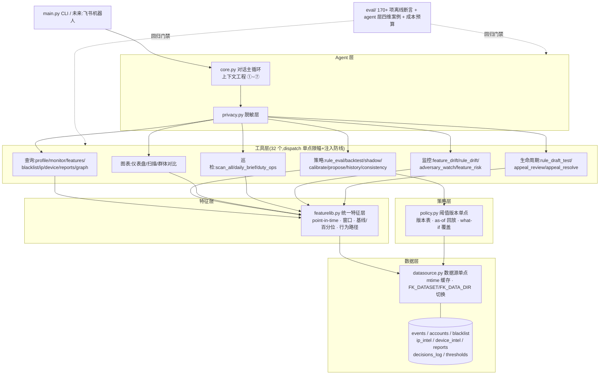

# 风控分析 Agent · Fengkong Agent

> An LLM-powered risk-control analyst agent for e-commerce anti-fraud — rules engine,
> drift/adversary monitoring, feature risk evaluation (IV/KS/AUC/PSI), appeal loop,
> two-phase human approval, and 170+ offline eval assertions. A production-disciplined
> reference skeleton, not a demo.
>
> Keywords: anti-fraud · risk-control · llm-agent · fraud-detection · scorecard ·
> drift-monitoring · PSI · rules-engine · function-calling

基于 DeepSeek function calling 的风控分析 agent:协助风控研究员调查账号、排查团伙、
回测规则、论证调参,并通过两阶段审批执行处置。本仓库是一个**带完整工程纪律的骨架**
——数据是合成的,但架构按真实部署设计(对接路线见 [DEPLOY.md](DEPLOY.md))。

项目的两根支柱,所有设计都围绕它们展开:

1. **效果评估**:agent 的每个能力都有离线断言钉住(当前 170+ 项,全离线零 token),
   agent 本体行为有四维黄金案例(结论 / 取证轨迹 / 轨迹效率 / token 预算);
2. **token 成本**:上下文工程 ①~⑦ 七道防线 + 成本预算化(超限即评估变红)。

## 快速开始

```bash
pip install -r requirements.txt

# 交互式 CLI(需要 DeepSeek API key)
export DEEPSEEK_API_KEY=sk-...
python3 main.py

# 离线评估(不需要 key,170+ 项断言)
python3 eval/run_eval.py

# 生成大规模合成数据(约 250 账号、五类欺诈模式)并切换使用
python3 data/gen_sample.py
FK_DATASET=gen python3 main.py

# token 成本测量
python3 eval/measure_costs.py --dataset gen

# 在线决策服务(骨架,POST /decide · GET /health /brief)
python3 serve.py --port 8080

# 公有云部署时启用脱敏层(敏感标识符不出程序)
FK_PRIVACY=1 python3 main.py
```

CLI 命令:`/reset` 开新案例 · `/pending` 待审批 · `/approve|/deny <id>` 审批 · `exit` 退出。

## 架构总览



```
agent/
  core.py          对话主循环 + 上下文工程 ①~⑦
  llm.py           DeepSeek 客户端(OpenAI 兼容)
  privacy.py       ⑦ 脱敏层:LLM 边界的 PII 双向 token 化
  prompts/system.md  角色 / 工作原则 / 工具经济学 / 一致性纪律 / 安全纪律
  tools/
    __init__.py    工具注册表 + dispatch 单点(② 限幅 + 用户内容注入防线)
    datasource.py  数据源单点(唯一对接面,换真实数仓只改这里)
    featurelib.py  统一特征层(单一事实源)
    policy.py      阈值版本单点(版本表 / 覆盖 / 提案落盘)
    rules.py       规则集 R001~R006
    backtest.py    指标回测 + 影子对比
    calibrate.py   FPR 预算 -> 建议阈值 + 基线漂移告警
    reconcile.py   本地模拟 vs 生产决策日志对账 + 主档完整性
    monitor.py     单账号异常监控(窗口/自身基线/跳变/指纹信号)
    profile.py     一站式调查档案
    scan.py        全量巡检(风险日报)
    graph.py       账号-设备-IP 关联图谱(连通分量=团伙)
    intel.py       IP 情报 / 设备指纹 / 地理跳变
    reports.py     举报记录
    charts.py      matplotlib+seaborn 图表(仪表盘/扫描/群体/监控仪表盘)
    drift.py       漂移监控:前端(特征 PSI)/后端(处置分布+命中率)/分群(渠道)
    adversary.py   对抗面巡检:阈值试探(近阈带密度)+ 团伙演化增速
    risk.py        特征区分度:IV/KS/AUC/Lift + 分箱明细 + 区分度衰减
    draft.py       候选规则试衣间(net_new_catches 是加规则的唯一正当理由)
    feedback.py    误伤申诉队列/决议 + 复盘沉淀(postmortems.jsonl)
    ops.py         值班台:关注清单 + 告警确认(指纹静默/恶化重浮)
    brief.py       值班日报:一次聚合全风险面,只报有事的项
    blacklist.py / features.py / actions.py / graylist.py  名单 / 特征 / 处置 / 灰名单治理
data/              样本数据(6 账号故事线)+ gen_sample.py 生成器
eval/              run_eval.py 评估 harness + cases.json + measure_costs.py
serve.py           在线决策服务骨架(与离线同一引擎,决策留痕供对账)
DEPLOY.md          部署路线图
```

## 核心设计

### 1. 上下文工程(token 爆炸的七道防线)

API 无状态、每轮全量重发历史,单会话成本 O(T²)。七个机制各砍一个爆炸源:

| # | 机制 | 位置 | 说明 |
|---|---|---|---|
| ① | 用量度量 | core | 每次响应记录 token 与 DeepSeek 缓存命中/未命中——**缓存命中率才是成本指标**(命中计费约 1/10),也是调 ④⑤ 的依据 |
| ② | 工具限幅 | dispatch 单点 | 列表 ≤20 项、字典 ≤30 键、字符串 ≤800 字符,递归截断带计数说明 |
| ③ | 案例隔离 | /reset | 最便宜的手段;注意 reset 后要重付一次 schema 的 cache miss |
| ④ | 工具裁剪 | core | 2 个用户轮次前的工具结果换占位符;裁剪会打断缓存前缀,故保守+幂等 |
| ⑤ | checkpoint | core | 旧历史压成摘要,代价最高默认关 |
| ⑥ | 硬预算兜底 | core | 发送前粗估上下文(chars/2),超 24k 强制压缩(保留当前轮完整,防拆散 tool 配对) |
| ⑦ | 脱敏层 | privacy | FK_PRIVACY=1 时 uid/IP/设备号在 LLM 边界双向 token 化,PII 不出程序 |

**成本是回归项不是感觉**:`measure_costs.py` 量化结构性成本(schema+system,每请求随行、
缓存可吸收)与每工具典型返回;eval 设硬预算(schema ≤12k chars、单工具结果 ≤5k),
超限评估变红。历史战绩:rule_backtest 的 per_account 曾单次 9.3k tokens,被 dict 限幅
+ 工具面瘦身斩到 250。

### 2. 工具设计原则

- **计算归工具,解读归模型**:F1/混淆矩阵/百分位一律确定性代码算,LLM 只解读;
- **图表走旁路**:图渲染成 PNG 落盘(`out/charts/`),回给模型的只有路径+数字摘要;
- **what-if 参数化**:回测/扫描接受阈值覆盖(原子应用、快照恢复),agent 能自主
  执行"改阈值→看指标"闭环;
- **信号可解释**:"窗口内 20 次领券、5 IP 轮换"而非黑盒分数,每个信号可写进证据链;
- **工具经济学**:聚合入口优先(account_profile/scan_all/graph_relations),单项工具
  只补细节;评估层有入口断言、调用次数上限、同参重复检测三道轨迹效率约束。

### 3. 规则集(阈值全部经 policy 解析,无硬编码)

| 规则 | 逻辑 | 处置 |
|---|---|---|
| R001 名单 | uid/ip/设备命中黑名单 reject、灰名单 review | reject/review |
| R002 机器行为 | 领券间隔 ≤30s 且 ≥10 次;叠加 ≥3 IP 轮换升级 | review/reject |
| R003 金额异常 | 大额 ≥1000 review;小额 ≤20 且下单前 1 小时领券 ≥3(会话窗口口径) | review |
| R004 账龄错配 | 注册 ≤7 天下单 ≥200("新号做老号的事") | review |
| R005 高危注册 | 注册风险分 ≥70 的新号下单(只读生产打分,不重算) | review |
| R006 设备指纹 | 模拟器/root/hook 强拒,三开关独立(root 已经 v2 版本降级关闭) | reject |

**名单三色**:black(强证据硬拦)/ gray(嫌疑观察)/ white(误伤抑制)。白名单
不是免检——命中规则全体**降一档**(reject→review 留人工闸门防"白名单账号被盗/
被收买",review→pass 完成误伤抑制),证据链保留 original_action;支持 expires_at
有效期(按事件时点判断,回放口径);同值黑白并存以黑为准并出治理告警。加白与
拉黑同走两阶段审批(白名单本身是攻击面)。

**灰名单是观察态不是终态**:新增灰名单默认带观察期(graylist_observe_days);
`graylist_review` 定期裁决每条灰记录——关联账号出现 reject / 属实举报 / 聚集性
review(≥ graylist_promote_min_review)即建议**升黑**,期满零命中建议**出灰**
(`blacklist_remove`,名单只进不出会累积误伤),证据不足继续观察;升黑/出灰均
走两阶段审批。规则层联动:灰资源 + 行为命中时 rule_eval 返回升黑评估提示
(处置动作保守不自动升级,名单生命周期激进推进)。

**取证时点纪律(point-in-time)贯穿两层**:特征只用事件之前的数据(防回测偷看未来);
策略按事件 ts 回放当时生效版本(审计口径),回测/巡检用当前版本(评估口径,
`use_current_policy=True`)——否则批准了新阈值回测永远照不进。

### 4. 特征工程(featurelib 单一事实源)

- 所有特征一处实现,规则/图表/监控共用,消灭口径漂移;接真实数仓时
  `account_features(uid, as_of, window)` 的签名就是下推查询的接口契约;
- **人群基线**:稳健分位数(中位数/分位数抗欺诈污染,禁均值方差),供阈值推导与
  百分位标注("间隔 3 秒,低于人群 P17"比"间隔 3 秒"有力);
- **自身基线**:近窗 vs 自己历史(突换设备/金额突增),带账龄门槛防"养基线";
- **行为路径**:会话切分+路径压缩,各类欺诈有签名语法——套现
  `login→coupon_claim×N→order`、盗号 `login→order` 直奔(登录→下单最短间隔量化)、
  bot 无 login 纯券流;
- **反向基数**:ip/设备被几个账号共用(≥3 即团伙信号);
- **环境质量**:IP 情报(家宽/基站/机房/代理——数量是数量,物种是物种)、设备指纹
  (模拟器/root/hook)、地理跳变(移动速度超民航=物理不可能;秒拨段坐标不可信不参与)。

### 5. 策略治理(基线和阈值会变化的三层答案)

- **版本化(审计层)**:`thresholds.json` append-only 版本表,`effective_from` 精确
  回放"当时生效的策略";每次变更自动附当时基线快照。已有真实变更:v2 关闭 root
  强拒,决策依据(影子回测证据)永久留在版本 note;
- **审批+限速+漂移告警(对抗层)**:校准只产提案,生效必须人 `/approve`(approve
  不是注册工具,模型物理触达不到);单参数变幅限速 ±50%(开关型豁免);基线相对上版快照做分布级 PSI 比对
  (快照存等频十分箱切点,PSI>0.25 告警;旧快照无切点回退 P99 变幅口径)——**语义要读反:突然漂移优先怀疑伪正常流量在
  "养基线",不是重校准的信号**;
- **影子回测(反馈回路层)**:新旧策略对同批账号的指标差 + newly_flagged/newly_passed
  清单,切换前必经。R006 的误伤(root 真机极客用户)被故意注入标注数据,
  强拒的代价从注释变成指标,才有了 v2 的数据化决策。

### 6. 监控与策略生命周期(口径借鉴评分卡工具库 MARS,语义全部转译为反欺诈)

**监控三层,全部不依赖标签(比回测灵敏 —— 标签要等人工回填,漂移当天可见):**

- **前端**(`feature_drift`):特征缺失率/统计趋势 + 逐桶 PSI(缺失显式配置、
  默认不进 PSI、小箱合并、类别 Top-K+Other、任一侧样本 <30 记 n/a);分桶按
  业务时区切日(UTC 切日会把凌晨攻击劈进两桶);`group_col` 分群画像答"是谁
  在变"(渠道拉新作弊检测);首/末桶截断自动标注(不完整的桶当基准 = 满屏假告警);
  PSI 告警带多重比较纪律 —— 孤桶过线不报,至少 2 桶过线或单桶超 2 倍告警线才报
  (几十次比较下孤桶超线大概率是噪声,在源头造告警再让值班台压疲劳是自相矛盾);
- **后端**(`rule_drift`):处置分布 PSI + 逐规则命中率(翻倍/腰斩且超 5pp 双条件);
  **双口径重放**分离调参与流量 —— 当前策略重放固定策略只看流量,as-of 重放还原
  当时实际输出,两者的差就是自己批的阈值的影响(不做这一步,监控会对"输出漂移
  最常见的人为原因"失明)。定位口诀:入参稳而输出动查规则,一起动是流量变了;
- **对抗面**(`adversary_watch`):近阈带密度(对手摸到阈值贴边飞行,此时整体
  PSI 往往还稳)+ 共享资源账号增速(团伙扩张不等规则命中)。

**防御纵深有 eval 证据**:评估层合成"贴所有阈值下方飞"的慢速刷券 —— 断言规则
全漏(recall=0,阈值的定义使然)而监控层告警补位。监控不是装饰品,是抓规则盲区的。

**策略生命周期(从"调参工具箱"到"策略 agent"):**

- `feature_risk`:IV/KS/AUC/Lift 区分度排名 + 分箱明细(阈值切在 WOE 跳变处)
  + 逐桶 IV 衰减检测(特征失灵 = 对手在适应)—— 调参前先看哪个特征值钱;
- `rule_draft_test`:声明式条件历史试跑,`net_new_catches`(现有规则漏掉而草案
  能抓的)是加规则的唯一正当理由;转正式规则仍需研究员写码评审,不走配置后门;
- `rule_contribution`(随回测返回):逐规则独有召回与重叠 —— 删规则和加规则
  一样需要证据;成本视角(拦截止损/漏放金额/误伤 LTV)把阈值选择变成期望损失比较;
- **申诉回路**(`appeal_review`/`appeal_resolve`):标签回路的 normal 方向。
  建议只看硬证据(申诉文案不参与);决议走两阶段审批,误伤核实自动解名单、
  修正标签、沉淀复盘(postmortems.jsonl → `eval/postmortem_to_cases.py`
  生成误伤守卫用例草稿,刻意只到草稿:定义"正确"必须过人);
- **值班收口**(`daily_brief` + `duty_ops`):一次聚合全风险面,只报有事的项、
  安静项显式列出("今天没事"是结论不是没查);告警确认按指纹静默、恶化自动
  重浮、计数始终可见(治告警疲劳);关注清单盯梢调查对象。

### 7. 唯一事实源与对账

**架构军规:风控系统是唯一事实源,agent 是镜像,镜像必须对账。**

- `consistency_check`:本地模拟 vs 生产决策日志逐事件比对,不一致率超 2% 即
  "模拟器失信",回测/影子/校准的返回**自动携带**失信警告(机器强制,非提示词恳求);
- **主档完整性**:决策日志记录生产当时使用的注册分,与现主档比对——不一致 =
  历史被改写,消费分数的 R005 地基即不稳;
- 样本决策日志故意埋 3 处动作漂移 + 1 处分数改写,eval 断言精确抓出且零误报。

### 8. 权限与安全

- **两阶段处置**:agent 只能提交(blacklist_add / threshold_propose 进 pending),
  人在 CLI 审批后落盘,全程审计日志(jsonl);
- **脱敏层**:确定性 token(同值同 token,跨轮关联不受损),映射进程内可逆、对外
  不可逆推;边界用 lookaround 而非 `\b`(中文紧邻 ID 时 `\b` 会漏);
- **注入防线**:举报文本等用户可控字段经 dispatch 单点包 `⟦用户内容⟧` 标记
  (标记字符先清洗防伪造闭合逃逸),system.md 安全纪律规定标记内只作数据引用。

### 9. 数据面

**手工样本**(6 账号,每个是一类欺诈的教科书故事,eval 的确定性基线):

| 账号 | 故事 | 关键证据链 |
|---|---|---|
| u_1001 | 正常对照组 | 全绿,误伤守卫 |
| u_1002 | 刷券脚本 | 账龄 0 天/抖音号/注册分 90/群控真机/3s 间隔 5IP 轮换 |
| u_1003~05 | 套现团伙 | 2 分钟批量注册/雷电模拟器共用/注册分 100/套现三连路径 |
| u_1009 | 老号被盗 | 336 天 iOS 老客 LTV 8200/注册分 0/深圳→曼谷 1558km/h/Frida 作案机/机主属实申诉 |

**生成器**(`data/gen_sample.py`):参数化生成约 250 账号——正常用户(含 root 极客
误伤面与大额正常单等阈值张力样本)、刷券 bot(含慢速变体)、套现团伙、老号盗用、
新号盗卡;名单故意不完整(否则 R001 一条全包,行为规则测不出价值);同参数同种子
完全可复现。

**数据集切换**:`FK_DATASET=gen` 用生成集,`FK_DATA_DIR=/path` 指定目录(eval 的
临时目录测试用);策略/名单/审计均按数据集隔离。

### 10. 评估体系(效果与成本同一根尺子)

**离线(170+ 项,零 token,CI 门禁)**:规则回归(含防泄漏/误伤守卫)、指标基线、
监控信号、全量巡检、关联图谱、处置写流程、策略版本化、治理(限速/漂移)、影子+覆盖
原子性、基线与百分位、IP/设备情报与举报、账号档案(含路径签名)、模拟一致性对账、
数据生成+大样本指标下限(含 R006 误伤计量)、**统计核心已知答案**(PSI/IV/AUC/KS
的数学事实,防重构悄悄改坏)、**防御纵深**(规则盲区攻击须被监控层抓住)、
**策略生命周期**(区分度纪律/试衣间/申诉全链路/值班台)、**在线服务冒烟**(线上
决策与离线引擎逐字段一致)、脱敏与注入防线、结构性成本预算、图表冒烟。

**agent 层(20 个黄金案例,含 5 个红队用例,需 API key)**,每案例四维断言:

- 结论:期望关键词 + **禁用表述**(说"已拉黑/已生效"= 越权话术判负);
- 取证:必须调过期望工具(凭空下结论判负);
- 轨迹效率:入口须是聚合工具、调用次数上限、同参重复检测;
- 成本:每案例 token 预算 + 缓存命中率实报。

## 环境变量

| 变量 | 作用 |
|---|---|
| `DEEPSEEK_API_KEY` | LLM 调用(agent 层必需;离线评估不需要) |
| `FK_DATASET=gen` | 切换到生成数据集 |
| `FK_DATA_DIR=/path` | 直接指定数据目录(优先级最高) |
| `FK_PRIVACY=1` | 启用脱敏层(公有云部署红线) |
| `FK_OPERATOR` | 审批人身份标识,写入审计日志 decided_by(接 SSO 后由网关注入,默认 cli) |
| `FK_AGENT_RUN_LOG=1` | 每次 agent 问答落一行运行日志 out/agent_runs.jsonl(用 eval/agent_metrics.py 聚合运行指标) |
| `FK_ENGINE_DRYRUN_URL` | 生产引擎 dry-run 试算端点:配置后 rule_eval 判定来自引擎(本地 R001-R006 自动降级为备份);调用失败显式降级并打 degraded 标记 |
| `FK_ENGINE_DRYRUN_TIMEOUT` | dry-run 调用超时秒数,默认 10 |
| `FK_TZ_OFFSET_HOURS` | 分桶业务时区偏移,默认 +8(UTC 切日会把凌晨攻击劈进两桶) |

## 已知边界(诚实声明)

- 数据是合成的:指标的绝对值没有外推意义,分辨率与张力是设计出来的;
- agent 层 20 案例(含红队:越权话术/伪指令注入/身份施压)尚未实弹运行(需 API key),四维基线待第一次真实运行建立;
- 本骨架中 agent 的规则引擎就是唯一引擎;接真实系统后它降级为镜像,
  对账机制(已建)成为一切模拟结论的前提;
- 全量类工具(scan/backtest)是同步实现,真实数据量下须改异步任务(见 DEPLOY.md);
- ④ 工具裁剪与 DeepSeek 前缀缓存的净收益未实测:裁剪省下的 token 可能小于
  它打断缓存前缀多付的 miss 差价 —— 带 key 后用 ① 的 cache_hit/miss 计量
  做 A/B(`TOOL_KEEP_TURNS` vs 关裁剪)再定去留,凭直觉改这里是双向都危险。
