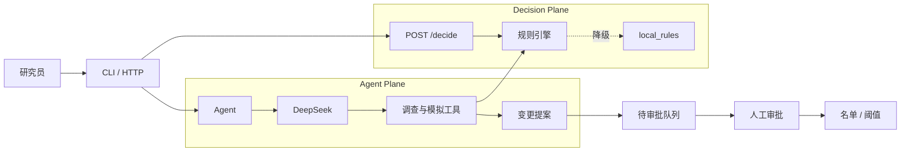

# 电商风控分析 Agent

基于 DeepSeek Function Calling 的电商风控分析工具，用于账号调查、团伙分析、规则回测和策略调参。

系统分为两个相互隔离的部分：

- **Agent Plane**：负责取证、分析、回测和生成变更提案；
- **Decision Plane**：负责在线判定，是决策结果的唯一来源。

涉及名单、阈值等状态的修改必须提交审批，Agent 不能直接使变更生效。仓库使用合成数据，适合本地研究、功能验证和二次开发，不应直接作为生产系统部署。

## 主要功能

- 账号、设备、IP 和关联团伙调查；
- 规则回测、阈值校准和候选规则试跑；
- 特征 IV、KS、AUC、Lift 和 PSI 评估；
- 特征漂移、规则漂移和对抗行为监控；
- 黑、灰、白名单及申诉处理；
- 模型、策略、特征和标签版本管理；
- 决策血缘、生产日志对账和事故跟踪；
- 写操作两阶段审批和全程审计；
- 离线回归测试、Agent 黄金案例和成本预算。

## 快速开始

安装依赖：

```bash
pip install -r requirements.txt
```

启动交互式 CLI：

```bash
export DEEPSEEK_API_KEY=sk-...
python3 main.py
```

常用 CLI 命令：

```text
/reset                  开始新案例
/pack                   切换工具包
/pending                查看待审批项
/approve <id>           批准提案
/deny <id>              拒绝提案
exit                    退出
```

运行离线评估：

```bash
python3 eval/run_eval.py
```

生成较大规模的合成数据并运行：

```bash
python3 data/gen_sample.py
FK_DATASET=gen python3 main.py
```

执行接数检查、回测、对账和门禁：

```bash
python3 eval/day1.py
```

启动决策服务：

```bash
python3 serve.py --port 8080
```

服务提供以下接口：

- `POST /decide`：执行风险判定；
- `GET /health`：查看服务及生产就绪状态；
- `GET /brief`：获取值班摘要。

## 架构



在线判定不经过 LLM。Agent 可以读取数据和执行模拟，也可以生成待审批提案，但审批只能由人在 CLI 中完成。

未配置 `FK_ENGINE_DRYRUN_URL` 时，判定使用本地 `local_rules`。生产接入方式见 [DEPLOY.md](DEPLOY.md)。

## 核心模块

```text
agent/
  core.py             对话与工具调用主循环
  llm.py              DeepSeek 客户端
  privacy.py          敏感标识符脱敏
  prompts/            Agent 提示词
  tools/
    datasource.py     数据源适配层
    featurelib.py     统一特征计算
    rules.py          风控规则
    backtest.py       规则回测
    calibrate.py      阈值校准
    profile.py        账号调查档案
    graph.py          账号、设备和 IP 关联图
    drift.py          特征与规则漂移监控
    adversary.py      对抗行为监控
    risk.py           特征风险评估
    feedback.py       申诉与反馈处理
    capability.py     工具权限控制
data/                 样本数据和数据生成器
eval/                 离线评估与黄金案例
serve.py              在线决策服务
DEPLOY.md              部署与生产接入说明
```

## 决策规则

内置规则覆盖以下场景：

- 名单命中；
- 高频领券和 IP 轮换；
- 大额订单及领券后小额下单；
- 新账号高额交易；
- 高风险注册账号；
- 模拟器、Root 和 Hook 环境；
- 已审批上线的模型风险信号。

规则阈值通过策略版本解析，不直接写死在业务流程中。名单和阈值变更需要先生成提案，再由人工审批。

## 数据与评估

`data/` 中的手工样本包含正常账号、刷券脚本、套现团伙和盗号等案例。`data/gen_sample.py` 可生成约 250 个账号的可复现数据集，用于回测和压力测试。

离线评估不调用 LLM，覆盖规则、特征、漂移监控、审批流程、版本管理、对账、安全边界和成本预算。需要 API Key 时，还可以运行 Agent 黄金案例，检查分析结论、取证路径、工具调用效率和 token 消耗。

<!-- AUTO-SYNC:FK-DOC-SNAPSHOT-START -->
### 当前评估快照

以下内容由 `python3 eval/run_eval.py --report` 自动更新：

| 项 | 值 |
|---|---|
| git commit | `a1d5a8e` |
| 工具数 | 85 |
| 工具 schema | 38479 chars |
| system prompt | 5633 chars |
| 数据指纹 | `028ccc9fef784b6b` |
| 离线断言数 | 476 |
| agent 黄金案例 | 24 |
| 最近刷新（UTC） | 2026-08-16T09:46:45Z |

<!-- AUTO-SYNC:FK-DOC-SNAPSHOT-END -->

## 环境变量

| 变量 | 作用 |
|---|---|
| `DEEPSEEK_API_KEY` | 调用 DeepSeek；离线评估不需要 |
| `FK_DATASET=gen` | 使用生成数据集 |
| `FK_DATA_DIR=/path` | 指定数据目录，优先级高于 `FK_DATASET` |
| `FK_PRIVACY=1` | 启用敏感标识符脱敏 |
| `FK_OPERATOR` | 设置审批人标识 |
| `FK_AGENT_RUN_LOG=1` | 记录 Agent 运行指标 |
| `FK_ENGINE_DRYRUN_URL` | 配置外部决策引擎试算接口 |
| `FK_ENGINE_DRYRUN_TIMEOUT` | 设置决策引擎调用超时 |
| `FK_ENGINE_MODEL_URL` | 配置模型评分服务 |
| `FK_FEATURE_ONLINE_MODULE` | 注入在线特征实现 |
| `FK_TOOL_PACK` | 选择工具包，默认 `analyst` |
| `FK_TZ_OFFSET_HOURS` | 设置业务时区偏移，默认 `+8` |

公有云环境建议启用脱敏：

```bash
FK_PRIVACY=1 python3 main.py
```

## 安全边界

- LLM 不参与在线判定；
- Agent 无权执行审批；
- 写操作必须进入待审批队列；
- 工具按 `read`、`simulate`、`propose` 和 `execute` 分级；
- 审批和管理能力不注册为 Agent 工具；
- 敏感标识符可在 LLM 边界进行确定性脱敏；
- 决策、变更和执行操作保留审计记录。

白名单用于降低处置等级，不会跳过全部检查。回测、影子策略和反事实重放不会修改生产状态。

## 当前限制

- 仓库数据为合成数据，评估结果不能直接代表真实业务效果；
- 默认使用本地规则引擎，接入生产引擎后需要持续进行一致性对账；
- 未配置有效的 champion 模型和 active strategy 时，生产就绪检查会返回 `BLOCKED`；
- 部分批量任务目前仍为同步执行，大数据量场景需要接入独立任务系统；
- 在线特征、数仓、身份认证和审批系统需要按实际环境接入。

生产部署、数据源替换和外部系统接入参见 [DEPLOY.md](DEPLOY.md)。
