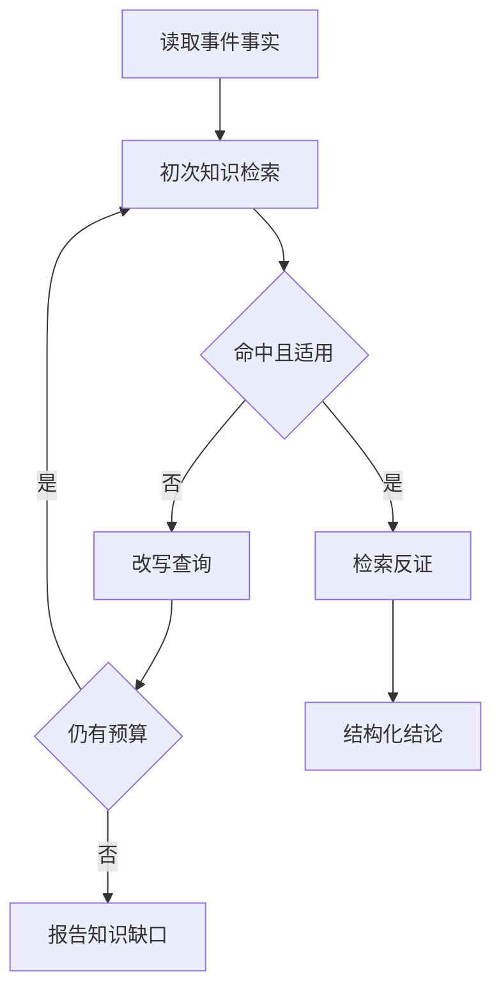

# 风控调查的有界纠错检索

这一版在现有 Agent 工具循环中实现纠错检索，不引入新的编排框架。服务端控制事件范围、
知识版本和预算；模型只决定查询文字、检索用途以及是否在剩余预算内改写查询。

## 执行顺序

1. 调查必须先调用 `get_event_evidence`，取得事件、已记录决策、SDK 观测以及可引用的
   `evidence_registry`。知识检索不能替代本次事件事实。
2. `search_risk_knowledge` 的每次调用必须说明：
   - `purpose`：`interpretation`、`support` 或 `counterevidence`；
   - `attempt_reason`：首次查询、无匹配、低相关、缺反证或扩大术语。
3. Agent 检查命中资料的版本适用性和 caveats。无匹配或相关性不足时，可以改写查询；
   完全相同的查询和过滤条件会被拒绝；只修改 purpose 不算新的检索。
4. 每个新任务最多进行3次知识检索。知识参与结论时，应单独检索反证或合法解释。
5. 最终输出结构化报告。每个 finding 必须绑定本次事件证据；知识引用使用精确
   `[K:chunk_id]`。系统检查引用是否来自本任务实际读取的材料。



## 最终报告合同

Agent 只返回一个 JSON 对象：

```json
{
  "verdict": "needs_review",
  "claims": [
    {
      "statement": "本次事件存在已验证来源的客户端观测，但不能单独证明欺诈。",
      "role": "finding",
      "event_evidence": ["event:<event_id>", "sdk:<evidence_id>"],
      "knowledge_citations": ["[K:<chunk_id>]"],
      "confidence": "medium"
    },
    {
      "statement": "合法调试仍是可能解释。",
      "role": "counterevidence",
      "event_evidence": [],
      "knowledge_citations": ["[K:<chunk_id>]"],
      "confidence": "low"
    }
  ],
  "missing_evidence": ["独立业务行为证据"],
  "recommended_next_step": "人工复核并补查行为证据"
}
```

`verdict` 只能是 `evidence_gap`、`needs_review`、`risk_supported` 或
`benign_explanation_supported`。结构审计会拒绝未知或格式错误的引用、缺少事件依据的
finding、没有证据的反证声明，以及使用知识后未做反证检索的报告。反证声明引用的知识
必须来自标记为 `counterevidence` 的检索，不能把支持性检索结果换一个标签重复使用。

## 结果中的审计信息

- `retrieval_audit`：每次检索的用途、原因、模式、命中数、反证是否命中、警告和最终 outcome。
  查询正文不写入结果，只保留短摘要，降低敏感信息扩散。
- `knowledge_citation_audit`：检查输出里的知识引用是否确实在本次任务中检索过。
- `claim_evidence_audit`：检查每条结论是否绑定已读取的事件证据和知识引用。
- `investigation_report`：通过结构验证后的报告；格式无效时为 null，原始 `summary` 保留审计。

这些检查证明来源绑定和流程完整性，不证明文字结论与来源之间存在语义蕴含。
真实语义支持仍需经标注样本评估，或后续增加独立、可审计的 claim evaluator。

## 兼容与边界

- 旧任务没有 `max_knowledge_searches` 时使用3次默认上限。
- 无 RAG 调用的调查允许结束，`retrieval_audit.outcome=not_used`；报告仍需给出反证或限制。
- embedding 配置失败继续显式回退 BM25，并在检索轨迹记录 warning。
- Agent 不能修改 `as_of`、索引指纹、事件范围和预算。
- 本轮不增加网页搜索。风控调查默认只使用已经审核和时间有效的内部知识。
